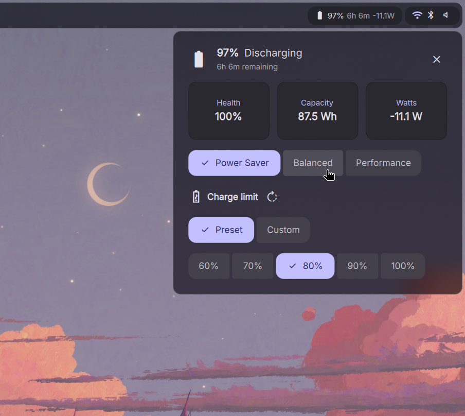

# dms-framework-battery



This plugin replaces the existing battery widget for [Dank Material Shell](https://github.com/AvengeMedia/DankMaterialShell). This adds the same features, as well as adding the ability to dynamically change the battery charge limit on Framework laptops.

> [!NOTE]
> Charge limit functionality will only work on Framework laptops with `ectool`. Charge limit functionality can be disabled in the plugin settings if you would like to use this plugin on other devices.

## Features
- Bar shows battery precentage and icon
    - Be able to show time remaining and wattage used
- When clicked, show more details
    - Battery percent
    - Battery state
    - Battery time remaining
    - Battery wattage used
    - Battery health
    - Battery capacity
    - Set PPD profile
    - Set framework charge limit, with presets and custom mode (60, 75, 80, 90, 100)

## Installation
The plugin can be installed from the [DMS plugin repository](https://danklinux.com/plugins).

Alternatively, it can be installed manually:
```bash
cd .config/DankMaterialShell/plugins
git clone https://github.com/nfoert/dms-framework-battery
```

Then, add the widget to your Dank Bar in `Settings > Dank Bar > Widgets`.
Change plugin settings in `Settings > Plugins > DMS Framework Battery`.

## Development
```bash
git clone https://github.com/nfoert/dms-framework-battery
# Broken symlinks may result if you do not specify the full path to wherever you cloned the plugin to
ln -s ~/dms-framework-battery ~/.config/DankMaterialShell/plugins/dmsFrameworkBattery
```

Enable the plugin in your settings, add it to your bar widgets, then reload it after making changes with:
```bash
dms ipc call plugins reload dmsFrameworkBattery
```

## To-Do
- [x] Get custom charge limit working
- [x] Fix remaining showing when plugged in
- [x] Adjust icon colors for charging / discharging / low battery
- [x] Use `RowLayout` and `ColumnLayout`
- [x] Fix text alignment in stat cards
- [x] Add widget settings for showing time remaining and wattage used
- [x] Hide remaining for both the bar widget and inside the component if it's zero
- [x] Hide wattage on the bar widget if it's zero
- [x] Wattage seems to always show `-` instead of `+` when plugged in
- [x] Only set the DMS settings for charge limit if the request to set the hardware charge limit succeeded
- [x] Add button for fetching the current hardware charge limit